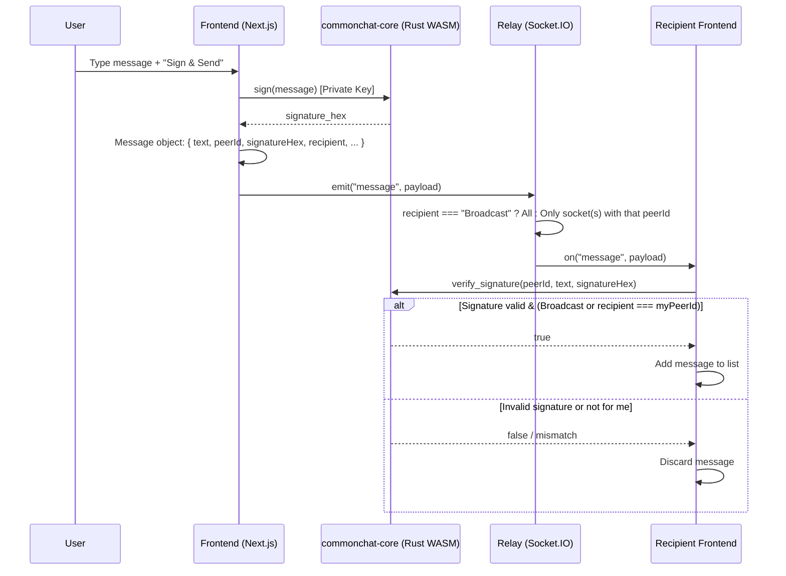

# CommonChat

Browser-based messaging with **Commonware cryptography (Ed25519)**. Messages are signed in the client, routed over a global WebSocket relay by Peer-ID, and verified in the client.

---

## Tech Stack

| Layer         | Technology |
|---------------|------------|
| **Frontend**  | Next.js 16, React 19, Tailwind CSS, TypeScript |
| **Relay**     | Node.js, Express, Socket.IO (WebSocket) |
| **Cryptography** | Rust → WebAssembly (WASM), [Commonware](https://github.com/commonwarexyz/monorepo) Ed25519 primitives |

- **Frontend:** Identity (localStorage), chat UI, Socket.IO client. Signing and verification via WASM module (`commonchat-core`).
- **Relay:** Single server; user registration (Peer-ID + display name), online list, message routing to recipient Peer-ID only. No crypto; relay only forwards.
- **Core (Rust/WASM):** Ed25519 key generation, message signing, signature verification. Built with `wasm-pack`; loaded as async WebAssembly in Next.js.

---

## Core Feature: Ed25519 Signing and Verification in the Browser

Commonware Ed25519 primitives are used in the browser as follows:

### Identity

- **Creation:** `create_identity()` uses a ChaCha20-based CSPRNG to produce a 32-byte seed; Commonware `PrivateKey::random(rng)` generates an Ed25519 private key. The public key is derived and stored as hex.
- **Persistence:** The private key is serialized as hex; `export_private_hex()` / `identity_from_private_hex()` write to and read from localStorage on reload. The private key is never sent to the server.

### Signing

- Message text plus a fixed **namespace** (`commonchat.v1`) is signed with Commonware `Signer::sign(namespace, message)`.
- The namespace scopes the signature to this app (signatures from other apps do not collide).
- The result is a 64-byte Ed25519 signature, returned to the frontend as a hex string and attached to the message payload.

### Verification

- For each incoming message, `verify_signature(pub_key_hex, message, signature_hex)` is called.
- The 32-byte public key and 64-byte signature are decoded from hex; Commonware `Verifier::verify(namespace, message, signature)` performs verification.
- Messages with invalid signatures are not added to the list (Commonware security requirement).

All crypto runs inside **Rust WASM**; the private key never leaves that context except as hex for storage.

---

## Architecture: Message Flow

Messages are signed in the client; the relay only routes; verification happens again in the client.



**Summary:**

1. **Sender:** Message text → WASM `sign()` → signature hex → message object sent to relay.
2. **Relay:** Forwards by `recipient`: either everyone (Broadcast) or only the socket(s) with that Peer-ID.
3. **Recipient:** Incoming payload → WASM `verify_signature()` → if valid and for me, add to list.

---

## Project Structure

```
commonchat/
├── core/                 # Rust WASM (commonchat-core)
│   ├── src/lib.rs        # create_identity, sign, verify_signature, identity_from_private_hex
│   └── pkg/              # wasm-pack output (frontend imports from here)
├── frontend/             # Next.js 16
│   ├── app/
│   │   ├── page.tsx      # Chat UI, Socket.IO, message/online list
│   │   └── hooks/        # useIdentity (WASM init, localStorage, sign/verify)
│   └── next.config.ts    # asyncWebAssembly for WASM
├── relay/                # Node.js Socket.IO server
│   └── server.js         # register, online_list, user_online/offline, message routing
├── commonware-source/    # Commonware monorepo (cryptography, math, codec, etc.)
├── .gitignore
└── README.md
```

---

## Setup

### Prerequisites

- Node.js 18+
- Rust + `wasm-pack` (for building core WASM):  
  `curl https://rustup.rs -sSf | sh`  
  `cargo install wasm-pack`

### 1. Build Core (WASM)

```bash
cd core
cargo build --target wasm32-unknown-unknown
wasm-pack build --target web --out-dir pkg
cd ..
```

This produces the WASM package in `core/pkg/` that the frontend imports.

### 2. Frontend

```bash
cd frontend
npm install
cp .env.example .env   # Optional; NEXT_PUBLIC_RELAY_URL defaults to http://localhost:3001
npm run dev
```

Open [http://localhost:3000](http://localhost:3000). On first load, enter an "Operator Name" and click Initialize; identity is stored in localStorage.

### 3. Relay (local testing)

```bash
cd relay
npm install
npm start
```

Default port: **3001**. The frontend uses `NEXT_PUBLIC_RELAY_URL=http://localhost:3001` in `.env`.

### Run everything locally

1. Terminal 1: `cd relay && npm start`
2. Terminal 2: `cd frontend && npm run dev`
3. In the browser: localhost:3000 → Initialize → Online Peers show other tabs/devices; messaging works.

---

## How to Deploy

### Frontend → Vercel

1. Connect the repo to [Vercel](https://vercel.com) and use "Import Project" (choose root or `frontend`; if root, set "Root Directory" to `frontend`).
2. Build: `npm run build` (or `cd frontend && npm run build`).
3. **Environment variable:**  
   `NEXT_PUBLIC_RELAY_URL` = your relay’s public URL (e.g. `https://your-app.up.railway.app`).
4. Deploy; the app will use this URL to connect to the relay.

### Relay → Railway or Render

The relay needs long-lived WebSockets; do not run it on Vercel serverless.

**Railway**

1. [railway.app](https://railway.app) → New Project → "Deploy from GitHub repo" (or `railway up`).
2. Set root to the `relay` folder (or select the relay directory).
3. Build: `npm install`  
   Start: `npm start`
4. Use "Generate Domain" to get a public URL; set that as `NEXT_PUBLIC_RELAY_URL` in the frontend.
5. `PORT` is set by Railway; if not, use 3001.

**Render**

1. [render.com](https://render.com) → New → Web Service; connect the repo.
2. Root directory: `relay`.
3. Build: `npm install`  
   Start: `npm start`
4. Use the instance URL as `NEXT_PUBLIC_RELAY_URL`.

**Note:** Serve the relay over HTTPS; CORS is enabled for cross-origin frontends (you can restrict origins in `relay/server.js` if needed).

---

## Git & GitHub

- The root `.gitignore` excludes `node_modules`, `.next`, `dist`, `.env`, `target`, etc., so sensitive or generated files are not committed.
- First push (if the repo is new):

```bash
git init
git add .
git commit -m "Initial commit: CommonChat with Ed25519 and relay"
git remote add origin https://github.com/YOUR_USERNAME/commonchat.git
git branch -M main
git push -u origin main
```

To commit the WASM build under `core/pkg/`, uncomment the `# core/pkg/` line in `.gitignore` and add that folder; otherwise build it in CI with `wasm-pack build`.

---

## License

Project license is defined in the repo; Commonware components are under their own licenses.
