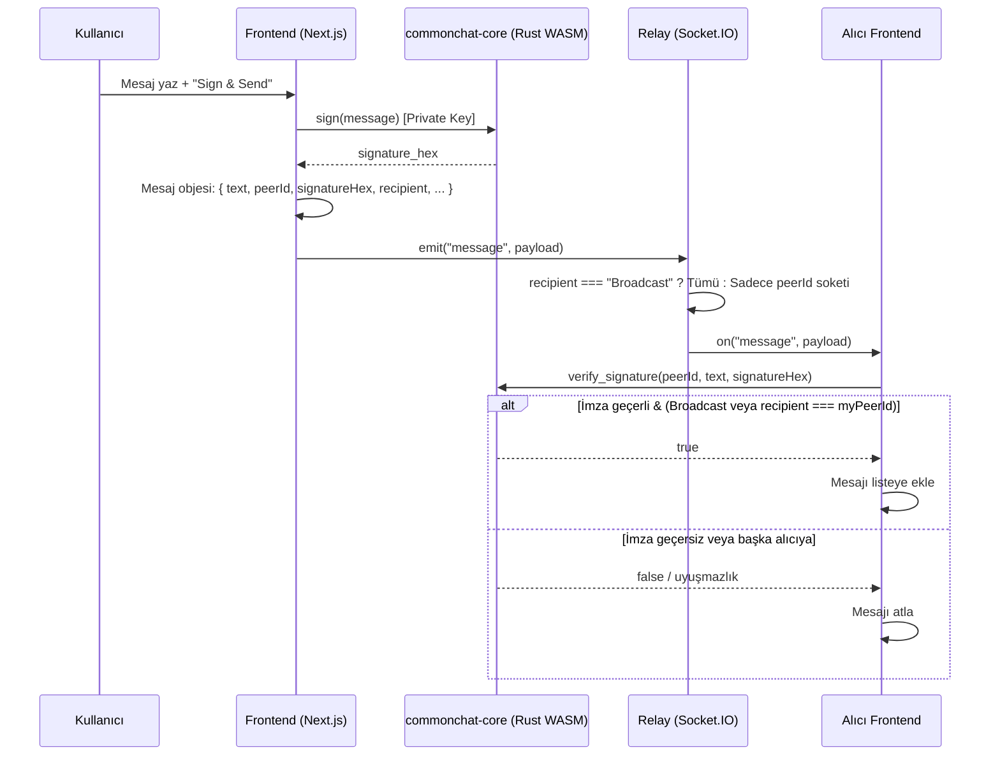

# CommonChat

Tarayıcı tabanlı, **Commonware kriptografisi (Ed25519)** ile imzalanmış mesajlaşma uygulaması. Mesajlar istemcide imzalanır, global bir WebSocket relay üzerinden Peer-ID’ye göre yönlendirilir; doğrulama yine istemcide yapılır.

---

## Tech Stack

| Katman        | Teknoloji |
|---------------|-----------|
| **Frontend** | Next.js 16, React 19, Tailwind CSS, TypeScript |
| **Relay**     | Node.js, Express, Socket.IO (WebSocket) |
| **Cryptography** | Rust → WebAssembly (WASM), [Commonware](https://github.com/commonwarexyz/monorepo) Ed25519 primitifleri |

- **Frontend:** Kimlik yönetimi (localStorage), chat UI, Socket.IO client. WASM modülü (`commonchat-core`) ile imzalama ve doğrulama.
- **Relay:** Tek sunucu; kullanıcı kaydı (Peer-ID + display name), online listesi, mesajı sadece alıcı Peer-ID’ye iletme. İmza doğrulamaz.
- **Core (Rust/WASM):** Ed25519 anahtar üretimi, mesaj imzalama, imza doğrulama. `wasm-pack` ile web paketi; Next.js tarafında async WebAssembly ile yüklenir.

---

## Core Feature: Tarayıcıda Ed25519 İmzalama ve Doğrulama

Commonware primitifleri (Ed25519) tarayıcıda şu şekilde kullanılıyor:

### Kimlik (Identity)

- **Oluşturma:** `create_identity()` → `ChaCha20` tabanlı CSPRNG ile 32 byte seed, Commonware `PrivateKey::random(rng)` ile Ed25519 özel anahtar üretilir. Ortak anahtar türetilip hex olarak saklanır.
- **Kalıcılık:** Özel anahtar hex serialize edilir; `export_private_hex()` / `identity_from_private_hex()` ile localStorage’a yazılıp sayfa yenilendiğinde geri yüklenir. Özel anahtar sunucuya gönderilmez.

### İmzalama (Sign)

- Mesaj metni + sabit **namespace** (`commonchat.v1`) Commonware `Signer::sign(namespace, message)` ile imzalanır.
- Namespace, imzayı uygulama/bağlam ile sınırlar (farklı uygulamaların imzaları birbirine karışmaz).
- Sonuç 64 byte Ed25519 imzası; hex string olarak frontend’e döner ve mesaj objesine eklenir.

### Doğrulama (Verify)

- Gelen her mesajda: `verify_signature(pub_key_hex, message, signature_hex)` çağrılır.
- Hex’ten 32 byte public key ve 64 byte signature decode edilir; Commonware `Verifier::verify(namespace, message, signature)` ile doğrulama yapılır.
- Geçersiz imzalı mesajlar listeye eklenmez (Commonware güvenlik gereksinimi).

Tüm kripto işlemleri **Rust WASM** içinde; özel anahtar JavaScript’e çıkmaz, sadece hex serialize/deserialize ile saklanır.

---

## Architecture: Mesaj Akışı

Mesajlar önce istemcide imzalanır, relay sadece yönlendirir; alıcı tarafta yine istemcide doğrulama yapılır.



**Özet:**

1. Gönderen: Mesaj metni → WASM `sign()` → imza hex → mesaj objesi Relay’e gönderilir.
2. Relay: `recipient` alanına göre mesajı ya herkese (Broadcast) ya da sadece ilgili Peer-ID’ye sahip sokete iletir.
3. Alıcı: Gelen payload → WASM `verify_signature()` → geçerli ve bana aitse listeye eklenir.

---

## Proje Yapısı

```
commonchat/
├── core/                 # Rust WASM (commonchat-core)
│   ├── src/lib.rs        # create_identity, sign, verify_signature, identity_from_private_hex
│   └── pkg/              # wasm-pack çıktısı (frontend buradan import eder)
├── frontend/             # Next.js 16
│   ├── app/
│   │   ├── page.tsx      # Chat UI, Socket.IO, mesaj/online listesi
│   │   └── hooks/       # useIdentity (WASM init, localStorage, sign/verify)
│   └── next.config.ts    # asyncWebAssembly (WASM için)
├── relay/                # Node.js Socket.IO sunucusu
│   └── server.js        # register, online_list, user_online/offline, message routing
├── commonware-source/    # Commonware monorepo (cryptography, math, codec vb.)
├── .gitignore
└── README.md
```

---

## Setup

### Ön koşul

- Node.js 18+
- Rust + `wasm-pack` (core WASM için):  
  `curl https://rustup.rs -sSf \| sh`  
  `cargo install wasm-pack`

### 1. Core (WASM) derleme

```bash
cd core
cargo build --target wasm32-unknown-unknown
wasm-pack build --target web --out-dir pkg
cd ..
```

Böylece `core/pkg/` içinde frontend’in import ettiği WASM paketi oluşur.

### 2. Frontend

```bash
cd frontend
npm install
cp .env.example .env   # İsteğe bağlı; NEXT_PUBLIC_RELAY_URL varsayılan: http://localhost:3001
npm run dev
```

Tarayıcıda: [http://localhost:3000](http://localhost:3000). İlk açılışta “Operator Name” girin (INITIALIZE); kimlik localStorage’a yazılır.

### 3. Relay (yerel test için)

```bash
cd relay
npm install
npm start
```

Varsayılan port: **3001**. Frontend `.env`’de `NEXT_PUBLIC_RELAY_URL=http://localhost:3001` kullanır.

### Tam yerel çalıştırma

1. Terminal 1: `cd relay && npm start`
2. Terminal 2: `cd frontend && npm run dev`
3. Tarayıcıda localhost:3000 → INITIALIZE → Online Peers’ta diğer sekmeler/cihazlar görünür, mesajlaşma çalışır.

---

## How to Deploy

### Frontend → Vercel

1. Repoyu GitHub’a bağlayın; [Vercel](https://vercel.com) ile “Import Project” yapın (root veya `frontend` klasörünü seçin; root ise “Root Directory” = `frontend` yapın).
2. Build: `npm run build` (veya `cd frontend && npm run build`).
3. **Environment variable:**  
   `NEXT_PUBLIC_RELAY_URL` = Relay’in public URL’i (örn. `https://your-app.up.railway.app`).
4. Deploy; bir sonraki deploy’da bu env ile relay’e bağlanır.

### Relay → Railway veya Render

Relay, uzun ömürlü WebSocket gerektirir; Vercel serverless’e koymayın.

**Railway**

1. [railway.app](https://railway.app) → New Project → “Deploy from GitHub repo” (veya `railway up`).
2. Root’u `relay` yapın veya relay klasörünü seçin.
3. Build: `npm install`  
   Start: `npm start`
4. “Generate Domain” ile public URL alın; bu URL’i frontend’te `NEXT_PUBLIC_RELAY_URL` olarak kullanın.
5. Ortam değişkeni: `PORT` (Railway otomatik verir; yoksa 3001).

**Render**

1. [render.com](https://render.com) → New → Web Service; repo’yu bağlayın.
2. Root directory: `relay`.
3. Build: `npm install`  
   Start: `npm start`
4. Instance’a verilen URL’i `NEXT_PUBLIC_RELAY_URL` olarak ayarlayın.

**Not:** Relay’i HTTPS ile sunun; frontend’in farklı bir domain’den bağlanması için CORS zaten sunucuda açık (gerekirse `relay/server.js` içinde origin kısıtlanabilir).

---

## Git & GitHub

- Kök `.gitignore` ile `node_modules`, `.next`, `dist`, `.env`, `target` vb. zaten yok sayılır; hassas veya türetilmiş dosyalar repo’ya eklenmez.
- İlk push için (repo yoksa):

```bash
git init
git add .
git commit -m "Initial commit: CommonChat with Ed25519 and relay"
git remote add origin https://github.com/KULLANICI/commonchat.git
git branch -M main
git push -u origin main
```

`core/pkg/` içindeki WASM çıktısını da repo’da tutmak isterseniz `.gitignore` içindeki `# core/pkg/` satırını kaldırıp bu klasörü commit edebilirsiniz; istemezseniz CI’da `wasm-pack build` ile üretirsiniz.

---

## Lisans

Proje lisansı repoda tanımlıdır; Commonware bileşenleri kendi lisanslarına tabidir.
